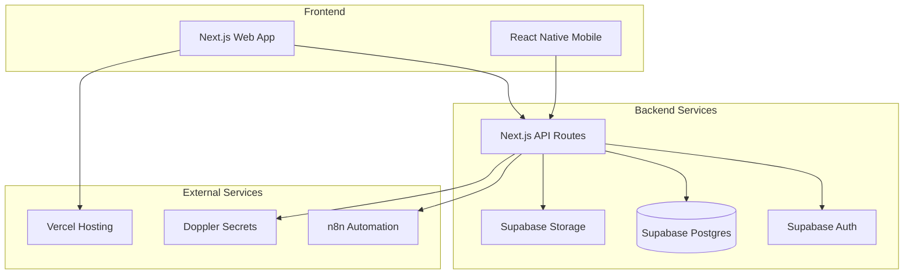
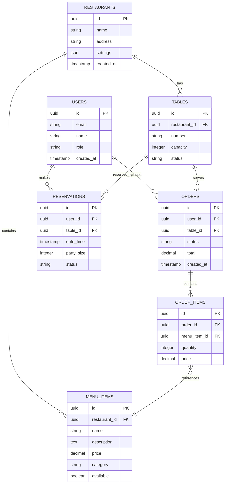
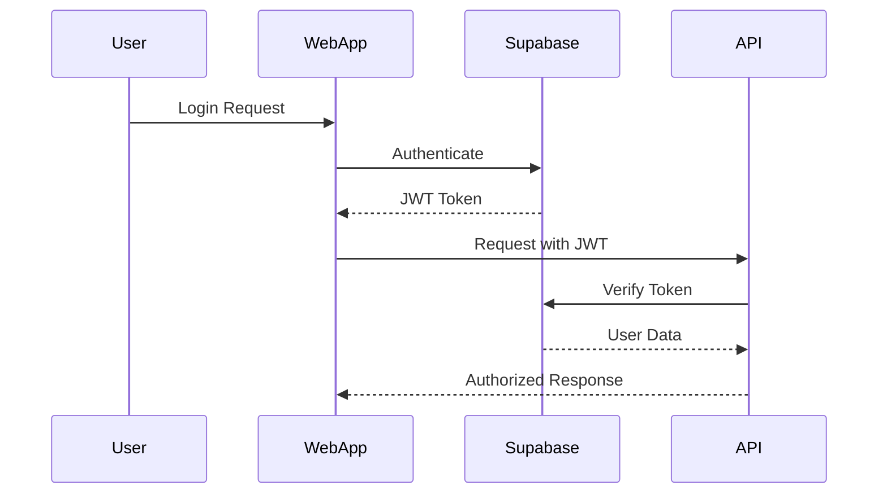

# Architecture

This document describes the overall architecture of the Hans Restaurant App, including system design, technology choices, and data flow.

## System Overview

The Hans Restaurant App is built as a modern, scalable restaurant management system with the following key components:



## Technology Stack

### Frontend
- **Next.js 15** - React framework with App Router
- **TypeScript** - Type-safe development
- **Tailwind CSS** - Utility-first CSS framework
- **shadcn/ui** - Component library
- **React Native** - Mobile app (planned)

### Backend
- **Next.js API Routes** - Serverless API endpoints
- **Supabase** - Backend-as-a-Service
  - PostgreSQL database
  - Authentication
  - Real-time subscriptions
  - File storage
- **n8n** - Workflow automation

### Infrastructure
- **Vercel** - Hosting and deployment
- **Turborepo** - Monorepo build system
- **pnpm** - Package manager
- **GitHub Actions** - CI/CD pipeline

## Data Architecture

### Database Schema



## API Design

### RESTful Endpoints

```typescript
// Authentication
POST   /api/auth/login
POST   /api/auth/logout
POST   /api/auth/register

// Menu Management
GET    /api/menu
POST   /api/menu
PUT    /api/menu/:id
DELETE /api/menu/:id

// Order Management
GET    /api/orders
POST   /api/orders
PUT    /api/orders/:id
GET    /api/orders/:id/items

// Table Management
GET    /api/tables
POST   /api/tables
PUT    /api/tables/:id
GET    /api/tables/:id/status

// Reservations
GET    /api/reservations
POST   /api/reservations
PUT    /api/reservations/:id
DELETE /api/reservations/:id
```

### Real-time Features

- **Order Status Updates** - Real-time order tracking
- **Table Availability** - Live table status updates
- **Kitchen Notifications** - New order alerts
- **Reservation Updates** - Real-time booking changes

## Security Architecture

### Authentication & Authorization



### Security Measures

- **JWT Authentication** - Secure token-based auth
- **Row Level Security (RLS)** - Database-level access control
- **CORS Configuration** - Cross-origin request security
- **Input Validation** - Zod schema validation
- **Rate Limiting** - API request throttling
- **HTTPS Only** - Encrypted communication

## Deployment Architecture

### Environment Strategy

```mermaid
graph LR
    subgraph "Development"
        Dev[Local Development]
        DevDB[(Local Supabase)]
    end
    
    subgraph "Staging"
        Staging[Vercel Preview]
        StagingDB[(Supabase Staging)]
    end
    
    subgraph "Production"
        Prod[Vercel Production]
        ProdDB[(Supabase Production)]
    end
    
    Dev --> Staging
    Staging --> Prod
```

### CI/CD Pipeline

1. **Code Push** - Developer pushes to feature branch
2. **Pull Request** - Automated checks run
3. **Preview Deployment** - Vercel creates preview
4. **Code Review** - Team reviews changes
5. **Merge to Main** - Production deployment triggered
6. **Database Migration** - Automated schema updates

## Performance Considerations

### Frontend Optimization

- **Code Splitting** - Lazy loading of components
- **Image Optimization** - Next.js Image component
- **Caching Strategy** - Static generation where possible
- **Bundle Analysis** - Regular bundle size monitoring

### Backend Optimization

- **Database Indexing** - Optimized query performance
- **Connection Pooling** - Efficient database connections
- **Caching Layer** - Redis for frequently accessed data
- **CDN Integration** - Global content delivery

## Monitoring & Observability

### Application Monitoring

- **Sentry** - Error tracking and performance monitoring
- **Vercel Analytics** - Web vitals and user behavior
- **Supabase Dashboard** - Database performance metrics

### Infrastructure Monitoring

- **Uptime Monitoring** - Health checks and alerts
- **Log Aggregation** - Centralized logging
- **Performance Metrics** - Response time tracking

## Future Considerations

### Scalability

- **Microservices Migration** - Break down monolith as needed
- **Database Sharding** - Horizontal scaling strategy
- **CDN Expansion** - Global content delivery
- **Caching Strategy** - Multi-layer caching

### Technology Evolution

- **React Server Components** - Enhanced server-side rendering
- **Edge Computing** - Vercel Edge Functions
- **AI Integration** - Smart recommendations and automation
- **Mobile App** - React Native implementation

## Decision Records

For detailed architectural decisions, see our [Architecture Decision Records (ADRs)](/adr/template).

## Related Documentation

- [Getting Started](/getting-started) - Development setup
- [Project Tooling](/tooling) - Development tools and workflows
- [API Reference](/api) - Detailed API documentation
- [Deployment Guide](/deployment) - Production deployment process
