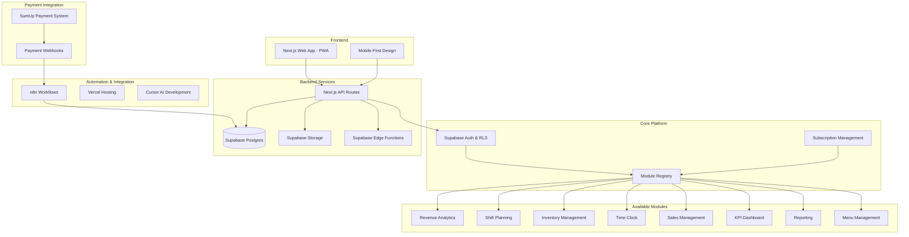
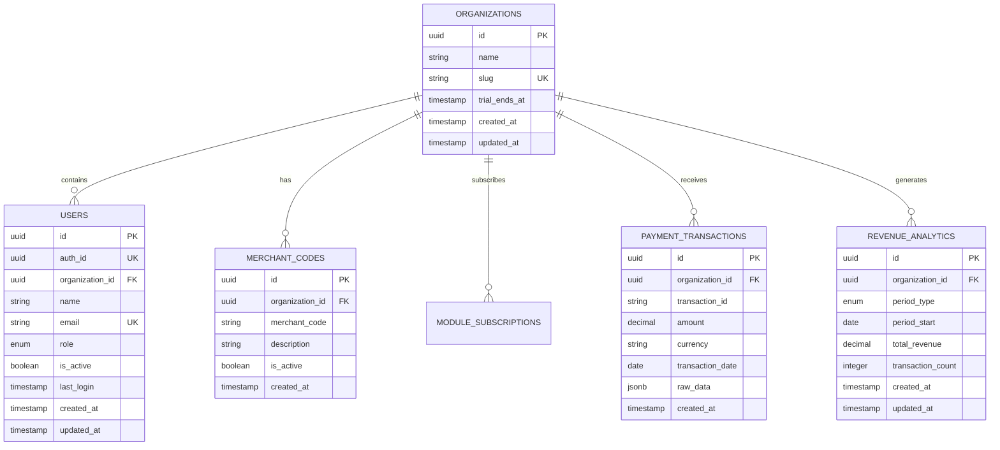
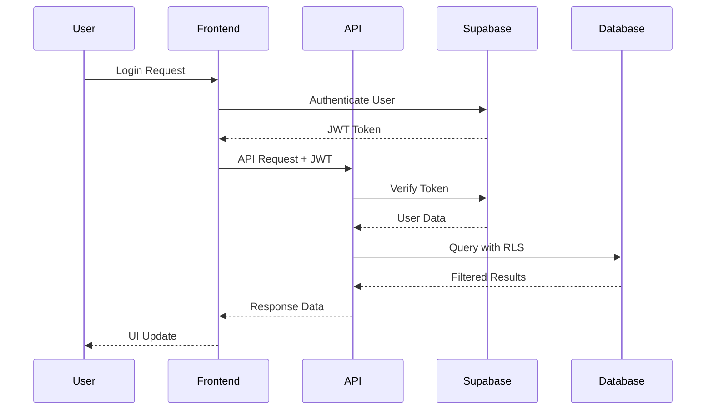
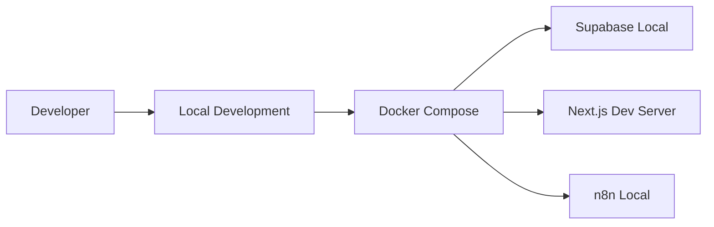
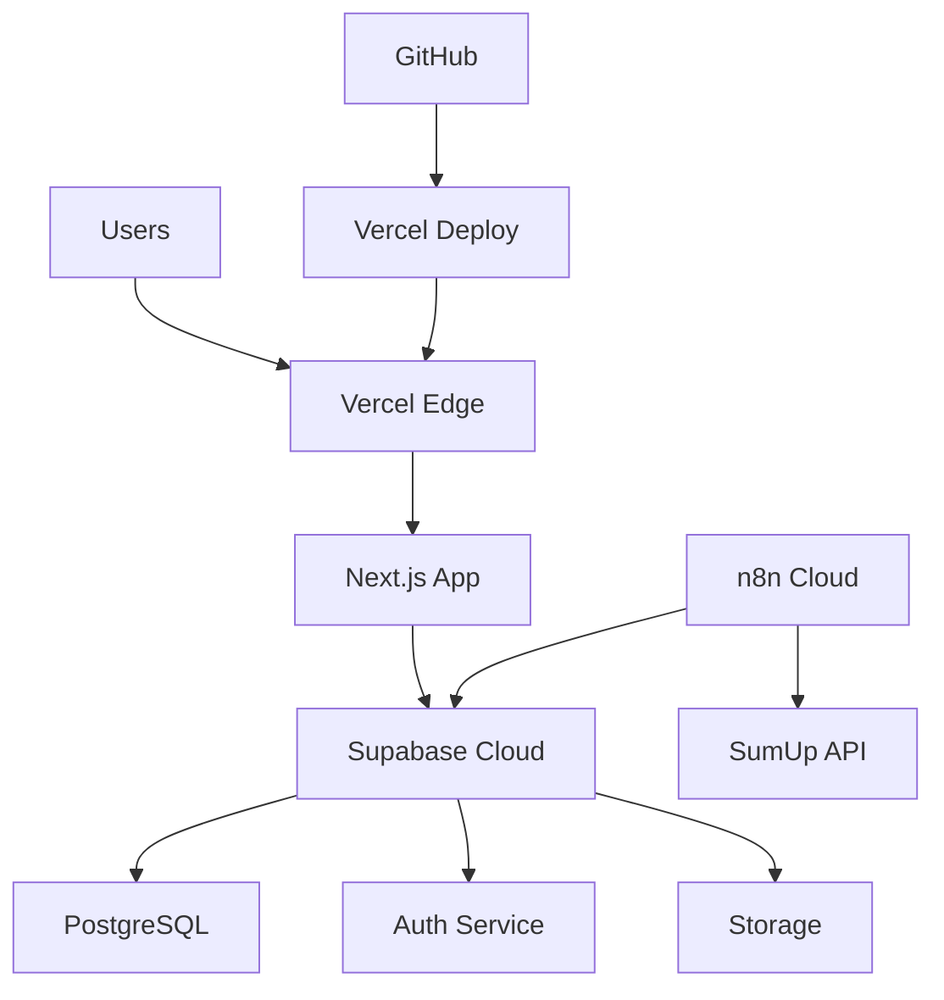

# Architecture

This document describes the overall architecture of the Hans Restaurant Management Platform, a modular SaaS solution for restaurant management with integrated payment processing.

## System Overview

The Hans Restaurant Management Platform is built as a comprehensive, modular SaaS system with the following key components:

### Current Implementation Status

**✅ Implemented Features:**
- Multi-tenant architecture with Row-Level Security (RLS)
- Role-based access control (Owner, Manager, Staff)
- Organization registration and user management
- Revenue analytics with real-time data processing
- Shift planning with manager editing capabilities
- Comprehensive API with authentication
- Responsive PWA with mobile-first design

**🚧 In Development:**
- SumUp Integration with encrypted API key management
- Dashboard Enhancement with real data and charts
- Advanced shift management features

**📋 Planned Features:**
- Inventory management module
- Time clock with GPS verification
- Menu management
- Advanced reporting
- Subscription billing system



## Technology Stack

### Frontend
- **Next.js 15** - React framework with App Router and Server Components
- **React 19** - Latest React with concurrent features
- **TypeScript** - Strict type checking and development
- **Tailwind CSS** - Utility-first CSS framework
- **shadcn/ui** - Modern component library
- **PWA** - Progressive Web App capabilities
- **Responsive Design** - Mobile-first approach

### Backend & Database
- **Next.js API Routes** - Serverless API endpoints with authentication
- **Supabase** - Complete Backend-as-a-Service
  - **PostgreSQL** - Multi-tenant database with RLS
  - **Authentication** - JWT-based auth with role management
  - **Row-Level Security** - Tenant data isolation
  - **Real-time** - Live data synchronization
  - **Storage** - File and media management
  - **Edge Functions** - Serverless compute
- **n8n** - Self-hosted workflow automation for SumUp integration

### Development & Infrastructure
- **Turborepo** - Monorepo build system with caching
- **pnpm** - Fast, disk space efficient package manager
- **Vercel** - Hosting, deployment, and edge functions
- **Docker** - Local development with Supabase
- **GitHub Actions** - CI/CD pipeline (planned)
- **Cursor AI** - AI-powered development environment

### Security & Monitoring
- **Row-Level Security (RLS)** - Database-level access control
- **JWT Authentication** - Secure token-based auth
- **Role-Based Access Control** - Owner, Manager, Staff permissions
- **Input Validation** - Zod schema validation
- **Error Monitoring** - Sentry integration (planned)
- **Analytics** - PostHog integration (planned)

## Data Architecture

### Multi-Tenant Database Design

The platform uses a multi-tenant architecture with Row-Level Security (RLS) to ensure complete data isolation between organizations. Each restaurant operates in its own secure data environment.

### Current Database Schema



### Row-Level Security (RLS)

All tables implement Row-Level Security policies to ensure data isolation:

- **Organizations**: Users can only access their own organization
- **Users**: Users can only see users within their organization
- **Payment Transactions**: Isolated by organization_id
- **Revenue Analytics**: Organization-specific data access
- **Merchant Codes**: Organization-specific merchant account management

### Database Functions

**Automated Revenue Analytics:**
```sql
CREATE OR REPLACE FUNCTION update_revenue_analytics()
RETURNS TRIGGER AS $$
-- Automatically updates daily, weekly, and monthly revenue analytics
-- when new payment transactions are inserted
```

**Organization Creation:**
```sql
CREATE OR REPLACE FUNCTION create_organization_with_owner(
    org_name TEXT,
    org_slug TEXT,
    owner_email TEXT,
    owner_name TEXT
) RETURNS uuid
-- Creates organization and initial owner user atomically
```

## API Architecture

### RESTful API Design

The platform exposes a comprehensive REST API with the following endpoints:

**Authentication:**
- `POST /api/auth/signup` - User registration
- `POST /api/auth/logout` - Session termination

**Organizations:**
- `POST /api/organizations` - Create new organization
- `GET /api/organizations/me` - Get current organization

**Users:**
- `GET /api/users` - List organization users
- `POST /api/users` - Create new user
- `DELETE /api/users/[id]` - Delete user
- `POST /api/users/update-login` - Update last login

**Revenue Analytics:**
- `GET /api/revenue?period=daily|weekly|monthly` - Get revenue data

### Authentication Flow



## Module Architecture

### Current Modules

**1. User Management Module**
- Organization registration
- User creation and management
- Role-based access control
- Session management

**2. Revenue Analytics Module**
- Real-time revenue tracking
- Daily/weekly/monthly reports
- Transaction aggregation
- Performance metrics

**3. Shift Planning Module**
- Shift creation and management
- Manager editing capabilities
- Staff schedule viewing
- Role-based permissions

### Planned Modules

**4. Inventory Management** (Phase 3)
- Stock tracking
- Supplier management
- Automated reordering
- Recipe costing

**5. Time Clock Module** (Phase 2)
- Clock in/out functionality
- GPS verification
- Break tracking
- Payroll integration

**6. Menu Management** (Phase 4)
- Digital menu creation
- Dynamic pricing
- Allergen information
- Performance analytics

## Security Architecture

### Multi-Layer Security

1. **Network Security**
   - HTTPS enforcement
   - CORS configuration
   - Rate limiting

2. **Application Security**
   - JWT token validation
   - Input sanitization
   - SQL injection prevention

3. **Database Security**
   - Row-Level Security (RLS)
   - Encrypted connections
   - Audit logging

4. **Access Control**
   - Role-based permissions
   - Organization isolation
   - Session management

### Data Privacy

- **GDPR Compliance**: User data protection and right to deletion
- **Data Isolation**: Complete tenant separation
- **Encryption**: Data encrypted in transit and at rest
- **Audit Trail**: Complete activity logging

## Deployment Architecture

### Development Environment



### Production Environment



## Performance & Scalability

### Optimization Strategies

- **Database Indexing**: Optimized queries with proper indexes
- **Caching**: Redis for session and data caching
- **CDN**: Vercel Edge Network for global performance
- **Code Splitting**: Dynamic imports for reduced bundle size
- **Image Optimization**: Next.js automatic image optimization

### Monitoring & Observability

- **Error Tracking**: Sentry for error monitoring
- **Performance**: Web Vitals and Core Web Vitals
- **Analytics**: PostHog for user behavior tracking
- **Uptime**: Health checks and monitoring
- **Logging**: Structured logging with correlation IDs

---

*Last updated: 2025-01-22*