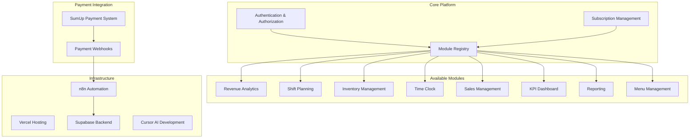

# Project Planning - Modular Restaurant SaaS Platform

## Project Overview

**Hans Restaurant Management Platform** is a comprehensive, modular SaaS solution for restaurant management. The platform consists of multiple independent modules that customers can subscribe to individually, with a unified payment system integration (SumUp) as the central data source.

## Core Architecture

### System Design



## Module Specifications

### 1. Revenue Analytics Module
**Purpose**: Analyze sales data from payment system
**Features**:
- Real-time revenue tracking
- Daily/weekly/monthly reports
- Payment method analysis
- Peak hours identification
- Revenue forecasting
- Comparative analytics

**Data Sources**: SumUp transactions, manual entries
**Target Users**: Managers, Owners

### 2. Shift Planning Module
**Purpose**: Manage staff schedules and shifts
**Features**:
- Visual shift calendar
- Staff availability management
- Automatic shift assignment
- Labor cost tracking
- Shift swap requests
- Overtime monitoring

**Data Sources**: Staff profiles, availability, labor costs
**Target Users**: Managers, Staff

### 3. Inventory Management Module
**Purpose**: Track and manage restaurant inventory
**Features**:
- Stock level monitoring
- Automatic reorder points
- Supplier management
- Cost tracking
- Waste management
- Recipe costing

**Data Sources**: Manual entries, supplier APIs, POS integration
**Target Users**: Kitchen staff, Managers

### 4. Time Clock Module
**Purpose**: Track employee work hours
**Features**:
- Digital time tracking
- GPS-based check-in/out
- Break management
- Overtime calculation
- Payroll integration
- Attendance reports

**Data Sources**: Mobile check-ins, GPS data
**Target Users**: All staff, HR, Payroll

### 5. Sales Management Module
**Purpose**: Manage sales operations and customer data
**Features**:
- Order management
- Customer database
- Loyalty programs
- Promotional campaigns
- Sales performance tracking
- Customer feedback

**Data Sources**: POS systems, SumUp, customer data
**Target Users**: Staff, Managers

### 6. KPI Dashboard Module
**Purpose**: Monitor key performance indicators
**Features**:
- Customizable dashboards
- Real-time metrics
- Goal setting and tracking
- Performance alerts
- Benchmark comparisons
- Executive summaries

**Data Sources**: All modules, external benchmarks
**Target Users**: Managers, Owners, Executives

### 7. Reporting Module
**Purpose**: Generate comprehensive business reports
**Features**:
- Automated report generation
- Custom report builder
- Scheduled reports
- Export capabilities (PDF, Excel)
- Compliance reporting
- Financial statements

**Data Sources**: All modules, accounting systems
**Target Users**: Managers, Accountants, Owners

### 8. Menu Management Module
**Purpose**: Manage restaurant menu and pricing
**Features**:
- Digital menu management
- Dynamic pricing
- Seasonal menu changes
- Nutritional information
- Allergen tracking
- Menu performance analytics

**Data Sources**: Manual entries, sales data
**Target Users**: Kitchen staff, Managers

## Technical Architecture

### Frontend Architecture
- **Framework**: Next.js 15 with App Router
- **UI Library**: shadcn/ui with Tailwind CSS
- **State Management**: Zustand for client state
- **Mobile**: Progressive Web App (PWA) with responsive design
- **Real-time**: Supabase real-time subscriptions

### Backend Architecture
- **Database**: Supabase PostgreSQL
- **Authentication**: Supabase Auth with RLS
- **API**: Next.js API Routes + Supabase Edge Functions
- **File Storage**: Supabase Storage
- **Automation**: n8n workflows

### Payment Integration
- **Primary**: SumUp API integration
- **Webhooks**: Real-time transaction updates
- **Data Processing**: n8n automation workflows
- **Backup**: Manual entry capabilities

## Database Schema Design

### Core Tables

```sql
-- Organizations (Restaurant chains)
CREATE TABLE organizations (
  id UUID PRIMARY KEY DEFAULT gen_random_uuid(),
  name VARCHAR(255) NOT NULL,
  slug VARCHAR(100) UNIQUE NOT NULL,
  settings JSONB DEFAULT '{}',
  subscription_tier VARCHAR(50) DEFAULT 'free',
  created_at TIMESTAMP WITH TIME ZONE DEFAULT NOW(),
  updated_at TIMESTAMP WITH TIME ZONE DEFAULT NOW()
);

-- Users (Staff members)
CREATE TABLE users (
  id UUID PRIMARY KEY DEFAULT gen_random_uuid(),
  organization_id UUID REFERENCES organizations(id) ON DELETE CASCADE,
  email VARCHAR(255) UNIQUE NOT NULL,
  name VARCHAR(255) NOT NULL,
  role VARCHAR(50) NOT NULL, -- owner, manager, staff, admin
  permissions JSONB DEFAULT '[]',
  is_active BOOLEAN DEFAULT true,
  created_at TIMESTAMP WITH TIME ZONE DEFAULT NOW(),
  updated_at TIMESTAMP WITH TIME ZONE DEFAULT NOW()
);

-- Module Subscriptions
CREATE TABLE module_subscriptions (
  id UUID PRIMARY KEY DEFAULT gen_random_uuid(),
  organization_id UUID REFERENCES organizations(id) ON DELETE CASCADE,
  module_name VARCHAR(100) NOT NULL,
  is_active BOOLEAN DEFAULT true,
  subscription_tier VARCHAR(50) DEFAULT 'basic',
  features JSONB DEFAULT '{}',
  expires_at TIMESTAMP WITH TIME ZONE,
  created_at TIMESTAMP WITH TIME ZONE DEFAULT NOW(),
  UNIQUE(organization_id, module_name)
);

-- Payment Transactions (from SumUp)
CREATE TABLE payment_transactions (
  id UUID PRIMARY KEY DEFAULT gen_random_uuid(),
  organization_id UUID REFERENCES organizations(id) ON DELETE CASCADE,
  sumup_transaction_id VARCHAR(255) UNIQUE,
  amount DECIMAL(10,2) NOT NULL,
  currency VARCHAR(3) DEFAULT 'EUR',
  payment_method VARCHAR(50) NOT NULL,
  status VARCHAR(50) NOT NULL,
  transaction_date TIMESTAMP WITH TIME ZONE NOT NULL,
  raw_data JSONB,
  created_at TIMESTAMP WITH TIME ZONE DEFAULT NOW()
);
```

### Module-Specific Tables

```sql
-- Revenue Analytics
CREATE TABLE revenue_analytics (
  id UUID PRIMARY KEY DEFAULT gen_random_uuid(),
  organization_id UUID REFERENCES organizations(id) ON DELETE CASCADE,
  date DATE NOT NULL,
  total_revenue DECIMAL(10,2) DEFAULT 0,
  transaction_count INTEGER DEFAULT 0,
  average_transaction DECIMAL(10,2) DEFAULT 0,
  payment_methods JSONB DEFAULT '{}',
  hourly_breakdown JSONB DEFAULT '{}',
  created_at TIMESTAMP WITH TIME ZONE DEFAULT NOW(),
  UNIQUE(organization_id, date)
);

-- Shift Planning
CREATE TABLE shifts (
  id UUID PRIMARY KEY DEFAULT gen_random_uuid(),
  organization_id UUID REFERENCES organizations(id) ON DELETE CASCADE,
  user_id UUID REFERENCES users(id) ON DELETE CASCADE,
  start_time TIMESTAMP WITH TIME ZONE NOT NULL,
  end_time TIMESTAMP WITH TIME ZONE NOT NULL,
  position VARCHAR(100),
  status VARCHAR(50) DEFAULT 'scheduled',
  notes TEXT,
  created_at TIMESTAMP WITH TIME ZONE DEFAULT NOW()
);

-- Inventory Management
CREATE TABLE inventory_items (
  id UUID PRIMARY KEY DEFAULT gen_random_uuid(),
  organization_id UUID REFERENCES organizations(id) ON DELETE CASCADE,
  name VARCHAR(255) NOT NULL,
  category VARCHAR(100),
  current_stock DECIMAL(10,2) DEFAULT 0,
  unit VARCHAR(50) NOT NULL,
  reorder_point DECIMAL(10,2) DEFAULT 0,
  cost_per_unit DECIMAL(10,2) DEFAULT 0,
  supplier VARCHAR(255),
  created_at TIMESTAMP WITH TIME ZONE DEFAULT NOW()
);

-- Time Clock
CREATE TABLE time_clock_entries (
  id UUID PRIMARY KEY DEFAULT gen_random_uuid(),
  organization_id UUID REFERENCES organizations(id) ON DELETE CASCADE,
  user_id UUID REFERENCES users(id) ON DELETE CASCADE,
  clock_in TIMESTAMP WITH TIME ZONE NOT NULL,
  clock_out TIMESTAMP WITH TIME ZONE,
  break_start TIMESTAMP WITH TIME ZONE,
  break_end TIMESTAMP WITH TIME ZONE,
  location_lat DECIMAL(10,8),
  location_lng DECIMAL(11,8),
  notes TEXT,
  created_at TIMESTAMP WITH TIME ZONE DEFAULT NOW()
);
```

## Development Phases

### Phase 1: Foundation (Weeks 1-4)
**Goal**: Set up core platform infrastructure

**Tasks**:
1. **Project Setup**
   - Turborepo monorepo structure
   - Next.js 15 with App Router
   - Supabase integration
   - Authentication system
   - Basic UI components

2. **Core Architecture**
   - Module registry system
   - Subscription management
   - User management with roles
   - Basic dashboard

3. **Payment Integration**
   - SumUp API integration
   - Webhook handling with n8n
   - Transaction data processing
   - Basic revenue tracking

**Deliverables**:
- Working authentication system
- Basic dashboard
- SumUp integration
- Core database schema

### Phase 2: Core Modules (Weeks 5-12)
**Goal**: Implement essential modules

**Tasks**:
1. **Revenue Analytics Module**
   - Transaction processing
   - Basic analytics dashboard
   - Daily/weekly reports
   - Payment method analysis

2. **Time Clock Module**
   - Mobile check-in/out
   - GPS verification
   - Basic time tracking
   - Simple reports

3. **Sales Management Module**
   - Order management
   - Customer database
   - Basic sales tracking

**Deliverables**:
- 3 working modules
- Mobile-responsive design
- Basic reporting capabilities

### Phase 3: Advanced Modules (Weeks 13-20)
**Goal**: Add advanced functionality

**Tasks**:
1. **Shift Planning Module**
   - Visual calendar interface
   - Staff scheduling
   - Availability management
   - Labor cost tracking

2. **Inventory Management Module**
   - Stock tracking
   - Supplier management
   - Reorder automation
   - Cost analysis

3. **KPI Dashboard Module**
   - Customizable dashboards
   - Real-time metrics
   - Performance alerts
   - Goal tracking

**Deliverables**:
- 6 working modules
- Advanced analytics
- Automation features

### Phase 4: Reporting & Optimization (Weeks 21-24)
**Goal**: Complete platform with advanced features

**Tasks**:
1. **Reporting Module**
   - Automated reports
   - Custom report builder
   - Export capabilities
   - Compliance reporting

2. **Menu Management Module**
   - Digital menu management
   - Dynamic pricing
   - Performance analytics

3. **Platform Optimization**
   - Performance optimization
   - Advanced security
   - Monitoring and alerts
   - Documentation completion

**Deliverables**:
- Complete 8-module platform
- Comprehensive documentation
- Production-ready system

## Technology Stack

### Frontend
- **Framework**: Next.js 15 (App Router, RSC)
- **Styling**: Tailwind CSS + shadcn/ui
- **State Management**: Zustand
- **Forms**: React Hook Form + Zod
- **Charts**: Recharts
- **Mobile**: PWA with responsive design
- **Real-time**: Supabase real-time

### Backend
- **Database**: Supabase PostgreSQL
- **Authentication**: Supabase Auth
- **API**: Next.js API Routes + Supabase Edge Functions
- **File Storage**: Supabase Storage
- **Automation**: n8n
- **Monitoring**: Sentry + Vercel Analytics

### Development Tools
- **IDE**: Cursor with AI assistance
- **Monorepo**: Turborepo + pnpm
- **Type Safety**: TypeScript (strict mode)
- **Code Quality**: ESLint + Prettier
- **Testing**: Vitest + Playwright
- **CI/CD**: GitHub Actions

### Payment & Integration
- **Primary Payment**: SumUp API
- **Webhooks**: n8n automation
- **Data Processing**: Real-time with Supabase
- **Backup Systems**: Manual entry capabilities

## Mobile-First Design Strategy

### Responsive Breakpoints
- **Mobile**: 320px - 768px (Primary focus)
- **Tablet**: 768px - 1024px
- **Desktop**: 1024px+

### Mobile Features
- **PWA**: Installable app experience
- **Offline Support**: Critical functions work offline
- **Touch Optimized**: Large touch targets
- **GPS Integration**: Location-based features
- **Camera Integration**: Photo capture for inventory
- **Push Notifications**: Real-time alerts

### Performance Targets
- **Lighthouse Score**: 90+ on all metrics
- **First Contentful Paint**: < 1.5s
- **Largest Contentful Paint**: < 2.5s
- **Cumulative Layout Shift**: < 0.1
- **Time to Interactive**: < 3.5s

## Security & Compliance

### Data Protection
- **GDPR Compliance**: EU data protection
- **Data Encryption**: At rest and in transit
- **Access Control**: Role-based permissions
- **Audit Logging**: All actions tracked
- **Data Retention**: Configurable policies

### Security Measures
- **Authentication**: Multi-factor authentication
- **Authorization**: Row-level security (RLS)
- **API Security**: Rate limiting, validation
- **Input Sanitization**: XSS protection
- **CSRF Protection**: Token-based validation

## Deployment & Infrastructure

### Hosting Strategy
- **Frontend**: Vercel (global CDN)
- **Backend**: Supabase (managed PostgreSQL)
- **Automation**: Self-hosted n8n
- **Monitoring**: Vercel Analytics + Sentry

### Environment Strategy
- **Development**: Local development with Supabase local
- **Staging**: Preview deployments on Vercel
- **Production**: Vercel production with Supabase cloud

### CI/CD Pipeline
- **Code Quality**: Automated linting, type checking
- **Testing**: Unit, integration, and E2E tests
- **Deployment**: Automated deployments on merge
- **Database**: Automated migrations
- **Monitoring**: Health checks and alerts

## Success Metrics

### Technical Metrics
- **Uptime**: 99.9% availability
- **Performance**: < 2s page load times
- **Error Rate**: < 0.1% error rate
- **Security**: Zero security incidents

### Business Metrics
- **User Adoption**: 80% of staff using daily
- **Module Usage**: 70% of subscribed modules active
- **Customer Satisfaction**: 4.5+ star rating
- **Revenue Growth**: 20% month-over-month

## Risk Management

### Technical Risks
- **Payment Integration**: SumUp API changes
- **Scalability**: Database performance at scale
- **Mobile Compatibility**: Cross-device issues
- **Data Loss**: Backup and recovery procedures

### Business Risks
- **Market Competition**: Feature differentiation
- **Customer Churn**: Retention strategies
- **Regulatory Changes**: Compliance updates
- **Economic Factors**: Pricing strategy

## Next Steps

1. **Immediate Actions**:
   - Set up development environment
   - Create detailed technical specifications
   - Begin Phase 1 development
   - Establish project timeline

2. **Short-term Goals** (Next 4 weeks):
   - Complete foundation setup
   - Implement basic authentication
   - Integrate SumUp payment system
   - Create core database schema

3. **Medium-term Goals** (Next 12 weeks):
   - Deliver 3 core modules
   - Achieve mobile responsiveness
   - Implement real-time features
   - Begin user testing

4. **Long-term Goals** (Next 24 weeks):
   - Complete 8-module platform
   - Achieve production readiness
   - Launch beta program
   - Prepare for scale

This comprehensive plan provides a roadmap for building a successful modular restaurant management SaaS platform that meets all requirements while following industry best practices.
